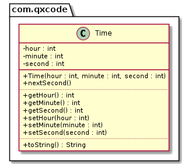

# Relógio & Utilizando os comandos set para manter a hora correta


<!--TOC_BEGIN-->
- [Descrição](#descrição)
- [Diagrama](#diagrama)
- [Esqueleto](#esqueleto)
<!--TOC_END-->

## Descrição
O sistema deverá:

- Gerenciar uma classe que guarda a hora, minuto e segundo.
- Crie os métodos getters e setters para cada atributo.
- Os métodos set devem garantir que os valores passados para os atributos sejam válidos.

## Diagrama


## Esqueleto
<!--FILTER Solver.java java-->
```java
class Time {
    private int hour = 0;
    private int minute = 0;
    private int second = 0;
    //utilize os métodos set para atribuir valores aos atributos
    //para garantir que o valor dos atributos sejam válidos
    public Time(int hour, int minute, int second);
    //se for um valor válido, ou seja, de 0 até 23,
    //atribui o valor ao atributo hour, se não, atribua 0
    public void setHour(int hour);
    //se for um valor válido, ou seja, de 0 até 59,
    //atribui o valor ao atributo minute, se não, atribua 0 
    public void setMinute(int minute);
    //se for um valor válido, ou seja, de 0 até 59,
    //atribui o valor ao atributo second, se não, atribua 0
    public void setSecond(int second);
    public int getHour();
    public int getMinute();
    public int getSecond();
    //avança o tempo em um segundo
    public void nextSecond();
    //você pode imprimir um inteiro forçando zeros a esquerda com o seguinte
    //comando em java String.format("%02d", valor)
    public String toString();
}
public class Solver{
    public static void main(String[] args) {
        Time time = new Time(23, 59, 59);
        System.out.println(time); //23:59:59
        time.nextSecond();
        System.out.println(time); //00:00:00
        time.nextSecond();
        System.out.println(time); //00:00:01


        time = new Time(40, 20, 59);
        System.out.println(time); // imprime: 00:20:59
        time.nextSecond();
        System.out.println(time); // imprime: 00:21:00

        time = new Time(60, -5, 70);
        System.out.println(time); // imprime: 00:00:00
    }
}
```
<!--FILTER_END-->
