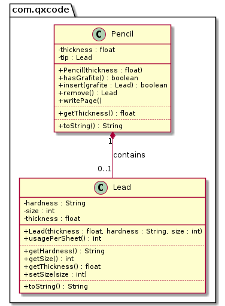

# Grafite & Lapiseira com um único grafite
[](Solver.java)

<!--TOC_BEGIN-->
- [Requisitos](#requisitos)
- [Shell](#shell)
- [Diagrama](#diagrama)
- [Esqueleto](#esqueleto)
<!--TOC_END-->

Faça o modelo de uma lapiseira que pode conter um único grafite.

## Requisitos
- Iniciar lapiseira
    - Inicia uma lapiseira de determinado calibre sem grafite.
- Inserir grafite
    - Insere um grafite passando
        - o calibre: float.
        - a dureza: string.
        - o tamanho em mm: int.
    - Não deve aceitar um grafite de calibre não compatível.
- Remover grafite
    - Retira o grafite se houver algum.
    - Se não houver grafite, imprimir mensagem de erro: "fail: nao existe grafite"
- Escrever folha
    - Não é possível escrever se não há grafite ou o grafite tem tamanho menor ou igual a 10mm.
    - Quanto mais macio o grafite, mais rapidamente ele se acaba. Para simplificar, use a seguinte regra:
        - Grafite HB: 1mm por folha.
        - Grafite 2B: 2mm por folha.
        - Grafite 4B: 4mm por folha.
        - Grafite 6B: 6mm por folha.
        
    - Os últimos 10 milímetros de um grafite não podem ser aproveitados. Quando o grafite tiver comprimento menor ou igual a 10mm, não é mais possível escrever e o grafite deve ser retirado.
    - Se não houver grafite suficiente para terminar a folha, avise que o texto ficou incompleto.
    - Avise quando o grafite acabar.


## Shell

```bash
#__case inserindo grafites
$init 0.5
$show
calibre: 0.5, grafite: null
$insert 0.7 2B 50
fail: calibre incompatível
$insert 0.5 2B 50
$show
calibre: 0.5, grafite: [0.5:2B:50]
$end
```

```bash
#__case inserindo e removendo
$init 0.3
$insert 0.3 2B 50
$show
calibre: 0.3, grafite: [0.3:2B:50]
$insert 0.3 4B 70
fail: ja existe grafite
$show
calibre: 0.3, grafite: [0.3:2B:50]
$remove
$insert 0.3 4B 70
$show
calibre: 0.3, grafite: [0.3:4B:70]
$end
```

```bash
#__case escrevendo 1
$init 0.9
$insert 0.9 4B 14
$write
$write
warning: grafite com tamanho insuficiente para escrever
$show
calibre: 0.9, grafite: [0.9:4B:10]
$remove
$show
calibre: 0.9, grafite: null
$insert 0.9 4B 16
$write
$show
calibre: 0.9, grafite: [0.9:4B:12]
$write
fail: folha incompleta
$show
calibre: 0.9, grafite: [0.9:4B:10]
$end
```


## Diagrama




***
## Esqueleto

<!--FILTER Solver.java java-->
```java
class Lead {
    private float thickness; //calibre
    private String hardness; //dureza
    private int size; //tamanho em mm
    public Lead(float thickness, String hardness, int size);
    public String toString();
    public float getThickness();
    public String getHardness();
    public int getSize();
    public void setSize(int size);
    public int usagePerSheet();
}
class Pencil {
    private float thickness;
    private Lead tip;
    public Pencil(float thickness);
    public String toString();
    public float getThickness();
    public boolean hasGrafite();
    public boolean insert(Lead grafite);
    public Lead remove();
    public void writePage();
}
class Solver{
    public static void main(String[] args) {
        Scanner scanner = new Scanner(System.in);
        Pencil lapiseira = new Pencil(0.5f);
        while(true) {
            String line = scanner.nextLine();
            System.out.println("$" + line);
            String ui[] = line.split(" ");
            if(ui[0].equals("end")) {
                break;
            } else if(ui[0].equals("help")) {
                System.out.println("init _calibre; insert _calibre _dureza _tamanho; remove; write");
            } else if(ui[0].equals("init")) { //thickness
                lapiseira = new Pencil(Float.parseFloat(ui[1]));
            } else if(ui[0].equals("insert")) {//thickness hardness size
                float thickness = Float.parseFloat(ui[1]);
                String hardness  = ui[2];
                int size = Integer.parseInt(ui[3]);
                lapiseira.insert(new Lead(thickness, hardness, size));
            } else if(ui[0].equals("remove")) {
                lapiseira.remove();
            } else if(ui[0].equals("show")) {
                System.out.println(lapiseira);
            } else if (ui[0].equals("write")) {
                lapiseira.writePage();
            } else {
                System.out.println("fail: icomando invalido");
            }
        }
        scanner.close();
    }
}
```
<!--FILTER_END-->


